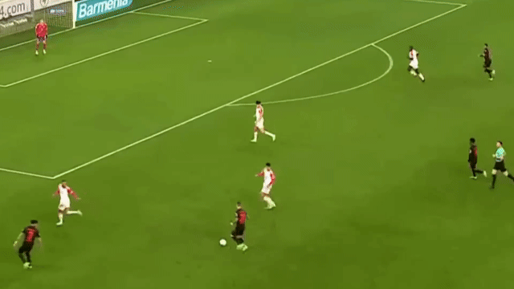
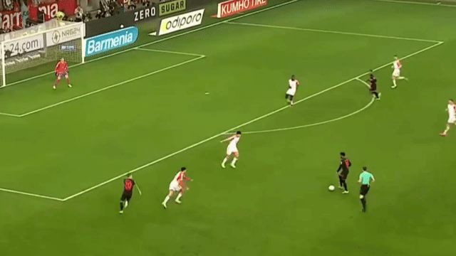
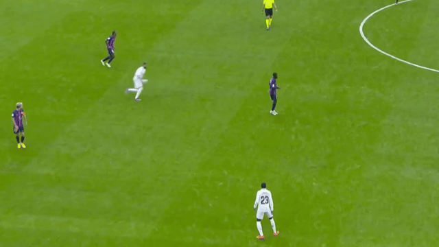
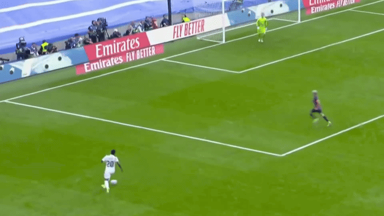

## Plan{.small}

- Study overview
- Central point
- Action projection in antagonistic interaction
- Association football as a site of interaction
- Materials and techniques
- Focal situations
- Empirical illustrations and analysis
  - misreading into misplay
  - nice read
- Concluding remarks

## Study overview

- Video-based study of embodied interaction in association football.
- Sociological treatment of the playing process (“doing playing”) as a social phenomenon in its own right.
- Exploration of accountable features of play actions as the groundings for intersubjective character of sports.

## Central point

::: {.fragment .highlight-current-blue}
As a course of action progresses, multiple trajectories of action co-exist projectably for fellow others, with reference to their ongoing activities, objectives, and resources at hand.
:::

::: {.fragment .highlight-current-blue}
In cooperative/collaborative interaction efforts, reducing the number of open possibilities is crucial.
:::

::: {.fragment .highlight-current-blue}
In antagonistic interaction efforts, maintaining the uncertainty of the ongoing interaction is crucial.
:::

## Projectability {.small}
  
Action projection enables members of a practice to coordinate their courses of action within an activity by anticipating the immediate continuation of an emerging or ongoing action by the other and adjusting their own conduct accordingly.[^projection]

[^projection]: See literature review in: Heath, Christian, and Paul Luff. “Embodied Action, Projection, and Institutional Action: The Exchange of Tools and Implements During Surgical Procedures.” _Discourse Processes 58_, no. 3 (March 16, 2021): 233–50. See also: Lerner, Gene H., and Geoffrey Raymond. “On the Practical Re-Intentionalization of Body Behavior: Action Pivots in the Progressive Realization of Embodied Conduct.” In _Enabling Human Conduct_, edited by Geoffrey Raymond, Gene H. Lerner, and John Heritage, 299–313. John Benjamins, 2017.

## Antagonistic interaction{.small}

In antagonistic[^antagonistic] social[^social] activities, where members and their collectives have the opposite interactional objectives, the projectability of action poses a practical problem since it enables the possibility to arrest, disrupt, or thwart the action by the counterpart.[^pivots]

[^antagonistic]: 
Levinson, Stephen C. “On the Human ‘Interaction Engine.’” In _Roots of Human Sociality: Culture, Cognition and Interaction_, edited by N. J. Enfield and Stephen C. Levinson, English ed., 39–69. Wenner-Gren International Symposium Series. New York, NY: Berg, 2006. On the social

[^social]:
Goodwin, Charles. _Co-Operative Action. Learning in Doing: Social, Cognitive and Computational Perspectives_. New York, NY: Cambridge University Press, 2018. See also, Simmel, Georg. _Sociology: Inquiries into the Construction of Social Forms._ Edited by Anthony J. Blasi, Anton K. Jacobs, and Mathew J. Kanjirathinkal. Vol. 1. Leiden: Brill, 2009.

[^pivots]:
Lerner, Gene H., and Geoffrey Raymond. “Body Trouble: Some Sources of Difficulty in the Progressive Realization of Manual Action.” _Research on Language and Social Interaction 54_, no. 3 (July 3, 2021): 277–98.

## Football as a site of interaction {.small}

Because the game is played by two teams with opposing interactional goals, association football combines cooperative and antagonistic features.

Players want their actions to be transparent to their teammates to enable teamwork, but camouflaged from their opponents.

Football players are less reliant on set pieces (unlike gridiron codes), but also less reliant on accidental events (unlike ice hockey).

Everything happens at an extremely high speed.

## Materials {.smaller}

- Footage of football matches:
  - televised footage;
  - tactical/technical camera footage.
- Professional and journalist accounts of the game.
- Personal experience of playing and officiating sports.

## Techniques

- "Normal" watching
- "Paranormal" watching:
  - off the ball;
  - tracking a particular player;
  - counting number of players in pitch zones.

## Focal game situations

- Progressive and through passes;
- "Dummy" runs;
- Pressing organization and triggers;
- Re-organization in transition phases;
- Defensive marking.

## Example 1: Misreading{.small}

Bayer Leverkusen v Bayern Munich

::: {.small}
Fußball-Bundesliga (Matchweek 21 --- February 10, 2024)  
:::

## {background-image="fig/tella00.png"}

## {background-image="fig/tella01.webp"}

## {background-image="fig/tella02.webp"}

## {background-image="fig/tella03.webp"}

## {background-video="vid/tella.mp4" background-video-loop="true" background-video-muted="true}

## 

:::: {.columns}

::: {.column width="50%"}
As the episode progresses, Mazraoui shifts to mark Hincapie in the wide area of the pitch, while Pavlovic marks Grimaldo.

:::

::: {.column width="50%"}

:::

::::

Grimaldo casts glances left (Mazraoui) and right (Tella).

Pavlovic also quickly scans the space behind him to keep an eye on Tella.

## What is projectable for Pavlovic?{.small}

:::: {.columns}

::: {.column width="50%"}
* Grimaldo to Hincapie  
  (not dangerous: Mazraoui marks him)
* Grimaldo dribbles into the box  
  (dangerous! Have to mark.)
* Grimaldo passes to Tella  
  (maybe dangerous: keep in mind.)

:::

::: {.column width="50%"}

:::

::::

## 

:::: {.columns}

::: {.column width="50%"}
Grimaldo passes the ball to Tella and immediately dashes into the box to open for a "wall" pass.
:::

::: {.column width="50%"}

:::

::::

Min-jae projects a wall pass and points Pavlovic to mark Grimaldo.

Pavlovic re-orients to Tella.

## What does promt Pavlovic to re-orient to Tella?{.small}

:::: {.columns}

::: {.column width="50%"}
**Candidate explanation:** 

Pavlovic is a defensive midfielder. When the ball comes back, he tries to mark the area under his positional assignment, rather than continuing to mark Grimaldo.

:::

::: {.column width="50%"}

:::

::::

## 

:::: {.columns}

::: {.column width="50%"}
When Tella returns the ball to Grimaldo, Pavlovic is caught out of position: he can neither intercept the ball nor prevent Grimaldo from playing it.
:::

::: {.column width="50%"}

:::

::::

## Summary {.small}

:::: {.columns}

::: {.column width="60%"}
Pavlovic projects the first pass (Grimaldo to Tella), but not the second (Tella to Grimaldo).
:::

::: {.column width="40%"}
{width="60%"}
:::

::::

:::: {.columns}

::: {.column width="60%"}
As he fails to project the second pass, he is out of position to contribute to the defensive effort of his team.

Unlike Min-jae, Pavlovic has not "read" the episode.
:::

::: {.column width="40%"}
{width="60%"}
:::

::::

:::: {.columns}

::: {.column width="60%"}
Min-jae failed to project the **ball trajectory**; Pavlovic failed to project the **trajectory of action**.
:::

::: {.column width="40%"}
{width="60%"}
:::

::::

## Example 2: Nice read{.small}

Real Madrid v Barcelona 

::: {.small}
La Liga (Matchweek 9 --- October 16, 2022)  
:::

## {background-image="fig/modric.png"}

## {background-image="fig/modric01.webp"}

## {background-image="fig/modric02.webp"}

## {background-image="fig/modric03.webp"}

## {background-video="vid/modric.mp4" background-video-loop="true" background-video-muted="true}

## 

:::: {.columns}

::: {.column width="50%"}
Benzema moves towards Modric, Mendi dashes towards the box in the gap between Kounde and De Jong.

De Jong shifts his gaze between Modric and Mendi.
:::

::: {.column width="50%"}

:::

::::

## 

:::: {.columns}

::: {.column width="50%"}
De Jong glances at Mendi as he makes a run for the box.

De Jong projects a through pass to him and runs to mark the entrance to the box.
:::

::: {.column width="50%"}

:::

::::

## 

:::: {.columns}

::: {.column width="50%"}
Mendi points behind his back and tells Modric to pass the ball to Vini Jr instead of him.

De Jong switches his gaze between Mendi and Modric on the run, catching Mendi's gesture.
:::

::: {.column width="50%"}

:::

::::

## What is projectable to De Jong {.small}

:::: {.columns}

::: {.column width="50%"}
* Mendi makes a "dummy" run; Modric will pass the ball to the high-and-wide area to Vini Jr.

  Dangerous: Nobody marks Vini Jr.
* Modric still makes a through pass to Mendi.  

  DANGEROUS: It is into one on one with a goalkeeper.
:::

::: {.column width="50%"}

:::

::::

Nothing to be done, defending the entrance to the box is the highest priority.

#

:::: {.columns}

::: {.column width="60%"}
De Jong tracks the ball. When the ball travels through Mendi, Mendi immediately changes his movement trajectory...
:::

::: {.column width="40%"}

:::

::::

:::: {.columns}

::: {.column width="60%"}
... and arrives to the edge of the box in time to meet Vini Jr.
:::

::: {.column width="40%"}

:::

::::

## Summary

De Jong "reads" the episode and does not allow the opponent to exploit the numerical advantage in the wide area of the pitch.

His constant scanning to timely recognize and project both threats, switching seamlessly from marking Mendi to marking Vini Jr.

:::: {.columns}

::: {.column width="50%"}

:::

::: {.column width="50%"}

:::

::::

## Concluding remarks{.small}

In antagonistic embodied interaction, multiple action trajectories coexist until some increment of action becomes critical, giving certainty as to which action trajectory will be realised by the members. 

The world of a sports player features the unity of what is present and is coming to present.[^bourdieu] Due to the dynamics of embodied interaction, sports players must deploy their actions simultaneously with the onset of the actions of their teammates and opponents, rather than passively "reacting" to completed actions. The reference of their ongoing action is often not in the present, but in the immediate future.

[^bourdieu]: Bourdieu, Pierre. _The Logic of Practice._ Translated by Richard Nice. Stanford University Press, 1990. See EM treatment in:  McHoul, Alec. “How Can Ethnomethodology Be Heideggerian?” _Human Studies 21_, no. 1 (January 1, 1998): 13–26.
